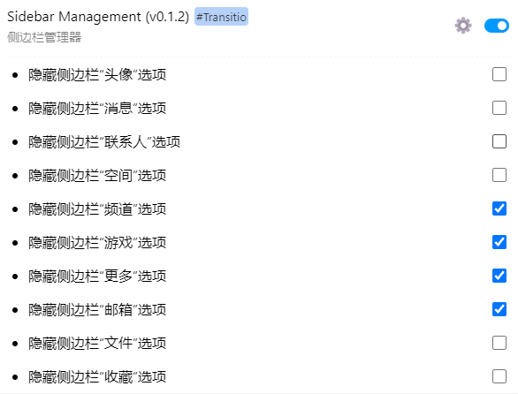

**适用于 [Transitio](https://github.com/PRO-2684/transitio) 插件的QQNT自定义样式**

> [!NOTE]
> 由于现在 QQ 风控较为严格，作者的账号也未能幸免，因此无法进行开发。因此样式已暂停维护。
>

## [sidebar-management](./sidebar-management.css)

可设置左边侧边栏的所有选项是否需要隐藏。

